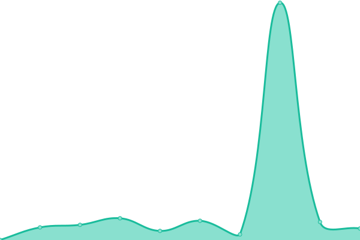
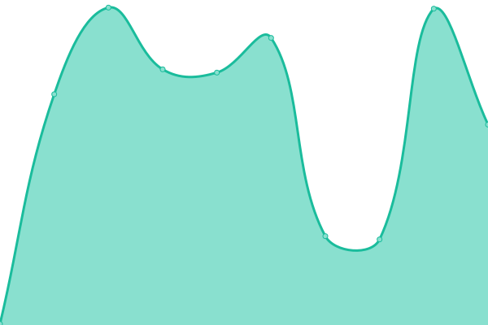

# [📈 Live Status](https://kendalldoescoding.tech): <!--live status--> **🟩 All systems operational**

This repository contains the open-source uptime monitor and status page for [Kendall](https://kendalldoescoding.tech), powered by [Upptime](https://github.com/upptime/upptime).

With [Upptime](https://upptime.js.org), you can get your own unlimited and free uptime monitor and status page, powered entirely by a GitHub repository. We use [Issues](https://github.com/KendallDoesCoding/monitoring/issues) as incident reports, [Actions](https://github.com/KendallDoesCoding/monitoring/actions) as uptime monitors, and [Pages](https://kendalldoescoding.tech) for the status page.

<!--start: status pages-->
<!-- This summary is generated by Upptime (https://github.com/upptime/upptime) -->
<!-- Do not edit this manually, your changes will be overwritten -->
<!-- prettier-ignore -->
| URL | Status | History | Response Time | Uptime |
| --- | ------ | ------- | ------------- | ------ |
|  [Portfolio](https://www.kendalldoescoding.tech) | 🟩 Up | [portfolio.yml](https://github.com/Kendall-Does-Coding-Websites/monitoring/commits/HEAD/history/portfolio.yml) | 

 291ms
     
 | 

<a href="https://kendalldoescoding.tech/history/portfolio">100.00%</a>
    

|  [A Very Mogul Christmas!](https://kendalldoescoding.tech/mogulchristmas) | 🟩 Up | [a-very-mogul-christmas.yml](https://github.com/Kendall-Does-Coding-Websites/monitoring/commits/HEAD/history/a-very-mogul-christmas.yml) | 

 224ms
     
 | 

<a href="https://kendalldoescoding.tech/history/a-very-mogul-christmas">100.00%</a>
    

|  [Let It Be - 1970 Album by The Beatles](https://kendalldoescoding.tech/letitbe) | 🟩 Up | [let-it-be-1970-album-by-the-beatles.yml](https://github.com/Kendall-Does-Coding-Websites/monitoring/commits/HEAD/history/let-it-be-1970-album-by-the-beatles.yml) | 

 154ms
     
 | 

<a href="https://kendalldoescoding.tech/history/let-it-be-1970-album-by-the-beatles">100.00%</a>
    

|  [Typing Game 2](https://kendalldoescoding.tech/typinggame2) | 🟩 Up | [typing-game-2.yml](https://github.com/Kendall-Does-Coding-Websites/monitoring/commits/HEAD/history/typing-game-2.yml) | 

 174ms
     
 | 

<a href="https://kendalldoescoding.tech/history/typing-game-2">100.00%</a>
    

|  [Tic Tac Toe](https://kendalldoescoding.tech/tictactoe) | 🟩 Up | [tic-tac-toe.yml](https://github.com/Kendall-Does-Coding-Websites/monitoring/commits/HEAD/history/tic-tac-toe.yml) | 

 215ms
     
 | 

<a href="https://kendalldoescoding.tech/history/tic-tac-toe">100.00%</a>
    

<!--end: status pages-->

[**Visit our status website →**](https://kendalldoescoding.tech)

## 📄 License

- Powered by: [Upptime](https://github.com/upptime/upptime)
- Code: [MIT](./LICENSE) © [Kendall](https://kendalldoescoding.tech)
- Data in the `./history` directory: [Open Database License](https://opendatacommons.org/licenses/odbl/1-0/)
